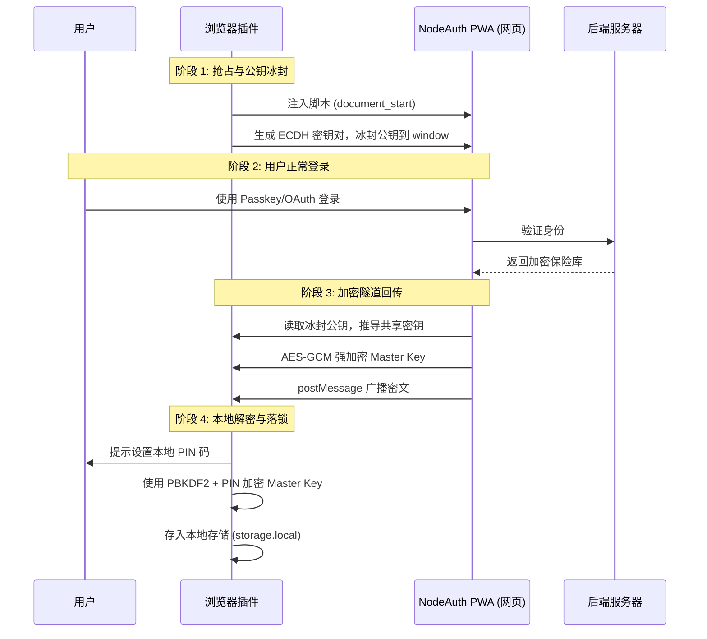

# 🧩 安全架构

NodeAuth 浏览器扩展不仅是 PWA 的延伸，更是一个**独立的、受物理隔离保护**的安全设备。它通过一套名为“DOM 冰封与加密隧道路由”的机制，确保您的主密钥（Master Key）在传递过程中绝不泄露。

## 1. 核心设计哲学

*   **鉴权下放 (Delegated Authentication)**：插件不直接处理您的 OAuth 或 Passkeys 登录，而是将其委托给您信任的 PWA 实例。
*   **零信任跨域通信 (Zero-Trust IPC)**：插件假设浏览器 DOM 环境可能存在恶意脚本（如流氓插件或 XSS 注入），因此所有核心数据均通过加密隧道传输。
*   **设备级隔离 (Device Isolation)**：每一台安装了插件的电脑都拥有唯一的设备指纹，您可以随时在主站设备管理中独立阻断任何一个插件的访问权限。

## 2. 安全握手流程 (时序图)

## 3. 深度安全机制

### DOM 冰封技术
在网页任何脚本运行之前，插件会通过 `Object.defineProperty` 将自己的公钥写入 `window` 对象，并设置 `writable: false`。这意味着即便网页后来感染了恶意脚本，也无法篡改这个公钥，从而保证了加密隧道的起点是纯净的。

### 内存级阅后即焚
*   **敏感私钥**：用于握手的 ECDH 私钥仅保留在插件后台的内存中，一旦握手完成立即销毁。
*   **无盘化传输**：Master Key 在解密前，绝不以任何形式写入硬盘，有效防范了物理磁盘取证攻击。

## 4. 安全风险核查

### 如果页面有 XSS 漏洞怎么办？
由于插件的“冰封”动作发生在网页加载的最早时刻（`document_start`），恶意 XSS 脚本运行之时，加密通道已经建立完毕。黑客截获的只有 AES-GCM 的高强度密文，在没有私钥的情况下，破解难度等同于暴力破解现代银行加密系统。

### 忘记插件 PIN 码能找回吗？
**不能。** PIN 码是本地加密的唯一钥匙，NodeAuth 不会在服务器存储您的 PIN 码或 Master Key。如果您忘记了 PIN 码，必须移除并重新安装插件。这虽然牺牲了一点便利性，但确保了即使 NodeAuth 服务器被黑，您的数据依然是安全的。
