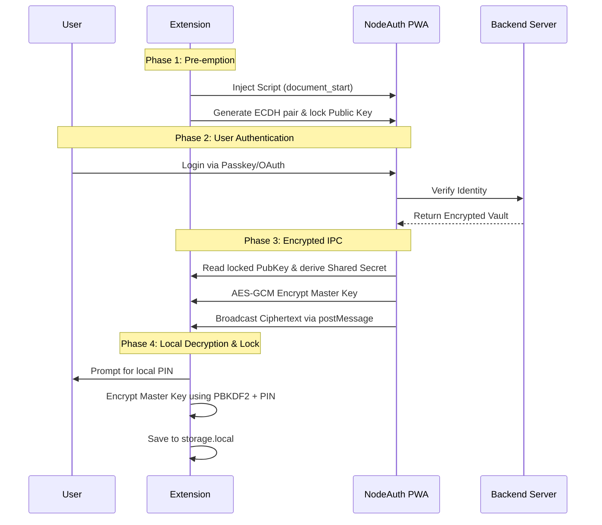

# 🧩 Security Architecture

The NodeAuth browser extension is more than just an add-on; it is a **standalone, physically isolated security device**. It uses a mechanism called "DOM Pre-emption & Encrypted Tunnel Routing" to ensure that your Master Key is never exposed during transmission.

## 1. Core Philosophy

*   **Delegated Authentication**: The extension does not handle your passwords directly. It delegates authentication to your trusted NodeAuth PWA instance.
*   **Zero-Trust IPC**: We assume the browser DOM environment may be hostile. All core data is transmitted through a secure, encrypted tunnel.
*   **Device Isolation**: Every instance of the extension acts as an independent "vault." You can revoke access for any specific extension at any time from the central device management dashboard.

## 2. Secure Handshake (Sequence Diagram)

## 3. Deep Security Mechanisms

### DOM "Freezing" Technology
Before any webpage scripts execute, the extension uses `Object.defineProperty` to write its public key to the `window` object with `writable: false`. This "freezes" the public key, preventing any malicious scripts (XSS) from tampering with the starting point of our encrypted tunnel.

### Memory-Only Volatile Storage
*   **Sensitive Keys**: The ECDH private key used for handshakes exists only in the background process's memory and is destroyed immediately after the handshake.
*   **Diskless Transmission**: Your Master Key is never written to the physical disk until it is re-encrypted with your local PIN.

## 4. Security Q&A

### What if the PWA has an XSS vulnerability?
Since the "Freezing" happens at `document_start`, the encrypted tunnel is established before any XSS scripts can run. An attacker would only intercept high-strength AES-GCM ciphertext, which is impossible to decrypt without the private key.

### Can I recover a forgotten PIN?
**No.** The PIN is the only key to your local vault. NodeAuth does not store your PIN or Master Key on its servers. If you forget your PIN, you must uninstall and reinstall the extension. While this may be less convenient, it ensures that your data remains safe even if the NodeAuth servers are compromised.
