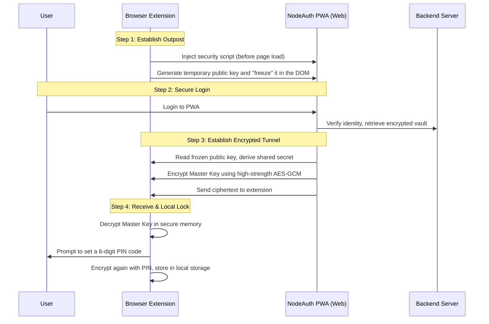

# 🧩 Security Architecture

The NodeAuth browser extension is not just a tool; it acts as an **independent, physically isolated** "digital safe".
Even if the web environment is compromised, your Master Key will never be exposed to malicious scripts.

## 1. Our Security Commitment (Core Design Philosophy)

To ensure absolute security for your data, we adhere to three ironclad rules:
*   **Delegated Authentication**: The extension itself never handles your account login (e.g., passwords, Passkeys). This responsibility is delegated to the NodeAuth PWA you fully trust.
*   **Zero-Trust Communication**: We assume the browser environment could be hijacked by malicious scripts (e.g., XSS injection) at any time. Therefore, all data exchange between the extension and the web page occurs through an "encrypted tunnel", leaving interceptors with nothing but gibberish.
*   **Device Isolation**: Every extension you install on a computer has a unique "fingerprint". If a device is lost, you can use your phone or another computer to remotely revoke that specific device's access with one click from the PWA.

## 2. Secure Handshake Flow (Diagram)

Here is the behind-the-scenes flow of how the extension securely obtains your authorized data:

## 3. Bulletproof Security Mechanisms

### "DOM Freezing" Technology (Anti-Tamper)
At the earliest stage of webpage execution, the extension "locks" its public key into the webpage object. This means even if the page is later infected by malicious scripts, this public key used to establish the tunnel cannot be replaced.

### Burn After Reading (Memory Level)
*   **Disposable**: The temporary "private key" used to establish the tunnel exists only in background memory and is destroyed immediately after the handshake completes.
*   **Never Touches Disk**: Your Master Key is never written to disk before being decrypted, completely eliminating the possibility of hackers stealing the key via disk forensics.

## 4. Common Risk FAQ

### ❓ What if the page I visit has malicious scripts (XSS vulnerability)?
No need to worry. Because the extension's "freezing" action occurs at the very beginning of the page load, by the time malicious scripts wake up, the encrypted channel is already established. Hackers can only intercept a string of high-strength ciphertext. Without the private key, cracking it is equivalent to brute-forcing a modern banking system.

### ❓ Can I recover a forgotten extension PIN?
**Absolutely not.**
The PIN is the only key to unlock your local vault. The NodeAuth server will never store your PIN or Master Key. If you forget it, the only way is to remove and reinstall the extension. While this sacrifices a bit of convenience, it guarantees that **even if our servers are compromised, your data remains impregnable**.
